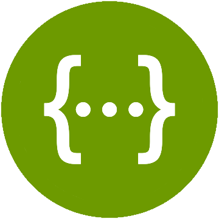

            
    &nbsp; &nbsp; &nbsp;
    

# 4IFA - PLD Agile - Backend

Ce projet a été réalisé dans le cadre du PLD Agile. L'équipe est constitué de 5 membres organisés dans une démarche Agile. La durée totale du projet est de 4 semaines, organisées en 4 sprint de une semaine.

L'objectif du projet est de concevoir et développer une application permettant de préparer des tournées de livraison optimisées.

Cette API expose les ressources nécessaires à l'IHM afin de répondre au besoin. Plus précisément il est possible de :
- Poster une Map à partir d'un fichier XML issue de OpenStreetMap
- Générer le Graphe de la Map
- Poster une Planning à partir d'un fichier XML
- Générer les plus court chemins de chaque paires de points
- Générer le plus court chemin en vue de réaliser une tournée

Le contrat swagger de l'API, définissant les différentes opérations possible, est déposé sous `src/main/ressources/swagger.yaml`

### Opérations

    

# Réalisation

Le service a été développée avec **Spring Boot** et la gestion des dépendances est réalisé avec **Maven**.

### Démarrer le service en local

Pour packager l'application avec Maven : `mvn clean install`

Démarrer l'application à partir du JAR : `java -jar justif-1.0.0.jar`

Démarrer l'application directement à partir de Maven : `mvn spring-boot:run`

Le swagger-ui de l'API est alors disponible sous : `http://localhost:8080/justif/swagger-ui.html`

## Spring Boot

**Spring Boot est un framework Java permettant de créer facilement des applications Spring autonomes, de qualité de production, simples à exécuter.**

Plus précisement,  Spring Boot permet de :
- Créer des applications Spring autonomes.
- Embarquer directement Tomcat, Jetty ou Undertow (pas nécessaire de déployer des fichiers WAR).
- Fournir des dépendances "starter" pour simplifier la configuration du build.
- Configurer automatiquement Spring et des bibliothèques tierces autant que possible.
- Fournir des fonctionnalités de production telles que des métriques, des contrôles de santé et des configurations externalisées.
- Aucune génération de code et aucune configuration XML requise.

## Design First 

Dans une approche Design First, une API est conçue de manière itérative, telle que la conception puisse être comprise (lisible) par l'ensemble des membres de l'équipe, mais également par les machines. 

Dans cette approche, tout le monde parle le même langage et tout le monde exploite la même conception d'API.

L'objectif est d'établir un contrat, appelé **contrat Swagger**, entre les différentes parties prenantes en s'abstrayant de toute technique.

Tout le monde s'engage alors à respecter ce contrat, que ce soit côté client ou serveur :
- Côté serveur, les équipes s'engagent en exposer correctement les ressources décrites dans le contrat.
- Côté client, les équipes s'engagent à consommer les ressources de la manière dont elles sont définies dans le contrat.

## Génération de code

A partir du contrat Swagger définit précédemment, il est possible de générer du code côté client et côté serveur.

Côté serveur, l'objectif est de générer le modèle ainsi que l'exposition de l'API. 
L'idée est alors d'étendre et d'implémenter ce code générer afin d'être sûr de respecter le contrat. 

Côté client, l'objectif est de générer le modèle et la consommation de l'API.
De la même manière, l'idée est d'étendre le code afin de s'assurer de consommer correctement l'API en respectant le contrat.

La génération de code permet entres autres aux équipes de se concentrer directement sur le code fonctionnel, gagnant en productivité. 

Enfin, il existe également des moyens d'automatiser la génération de code, comme c'est fait sur ce projet à l'aide de la dépendance OpenApi Generator.
Cela permet de générer le code à chaque build pour s'assurer que notre code est bien à jour avec la dernière version du contrat.

# Pour aller plus loin

Différentes ressources sur Spring Boot :
- [Documentation Officielle](https://spring.io/projects/spring-boot)
- [Guide - Démarrage rapide](https://spring.io/quickstart)
- [Guide - Construire une API Rest](https://spring.io/guides/gs/rest-service/)
- [Outil - Initialiser un projet Spring Boot](https://start.spring.io/)

Design d'API et génération de code :
- [Swagger Editor - Editer son swagger et générer son code en ligne](https://swagger.io/)
- [SpringFox - Génération de la documentation des Apis](https://springfox.github.io/springfox/)
- [OpenApi - Consortium pour la standardisation des APIs](https://www.openapis.org/)
